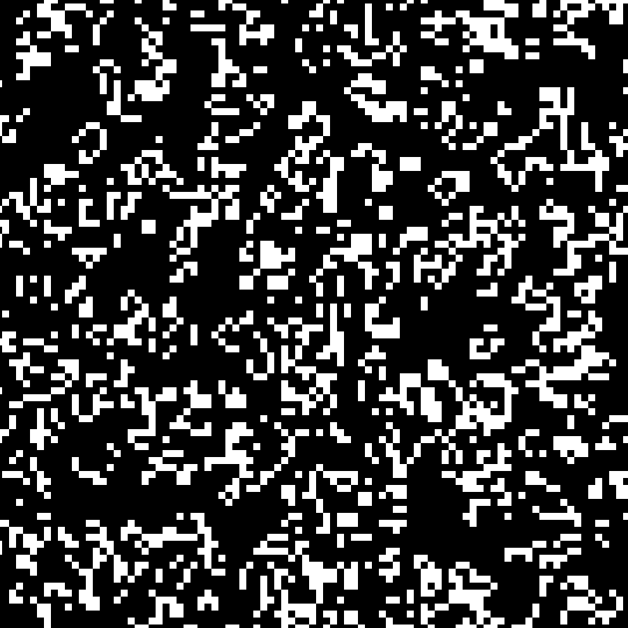

# game-of-life

This is an implementation of John Horton Conway's Game of Life algorithm in Python using Pygame. I thought it would be a fun project to implement as a way of experimenting with how graphic images and design could be generated through computer algorithms. The simple laws of the game of life, as well as its infinite complexity and at times remarkable beauty made this a particularly fun project to work on.

## Summary

The game of life is a zero player game devised by british mathematician John Horton Conway. It seeks to simulate, at a basic level, the interactions of organisms and the evolution of communities. There is human interaction once the game has started, rather the game is manipulated by the initial configuration, and then observed.

## Rules

The game of life is made up of an infinite grid of square "cells". Each cell can be in one of two states - living, or dead. Over each iteration, each cell interacts with its eight neighbours, the cells horizontally, vertically or diagonally adjacent to it. Depending on the amount of living or dead neighbours, the cell may either become alive, stay the same, or die.

The rules of the simulation are as follows:

1. Any live cell with fewer than two live neighbours dies, as if by underpopulation.
2. Any live cell with two or three live neighbours lives on to the next generation.
3. Any live cell with more than three live neighbours dies, as if by overpopulation.
4. Any dead cell with exactly three live neighbours becomes a live cell, as if by reproduction.

These rules, which compare the behavior of the automaton to real life occur simultaneously across a "tick", meaning births and deaths occur simultaneously. They can be condensed into the following logic:

1. Any live cell with two or three live neighbours survives.
2. Any dead cell with three live neighbours becomes a live cell.
3. All other live cells die in the next generation. Similarly, all other dead cells stay dead.

The initial pattern constitutes the seed of the system. The first generation is created by applying the above rules simultaneously to every cell in the seed; births and deaths occur simultaneously, and the discrete moment at which this happens is sometimes called a tick. Each generation is a pure function of the preceding one. The rules continue to be applied repeatedly to create further generations.

## Example

